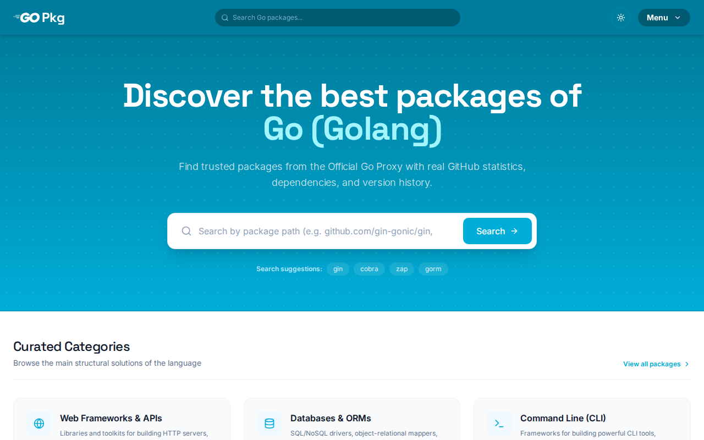
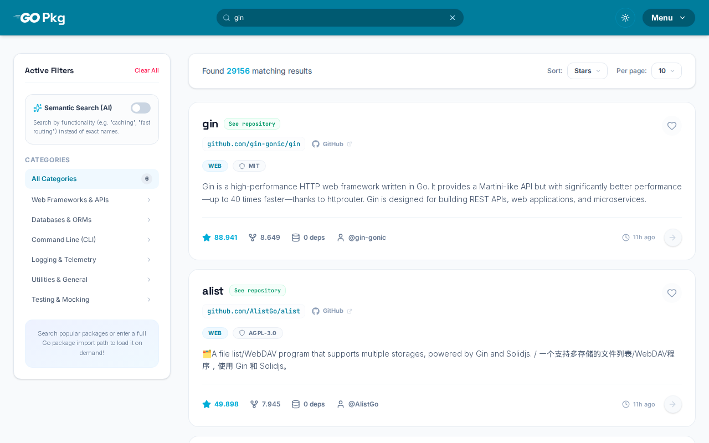
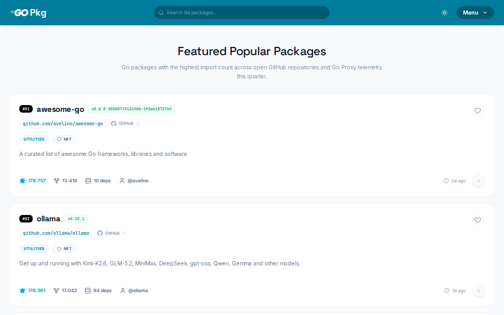
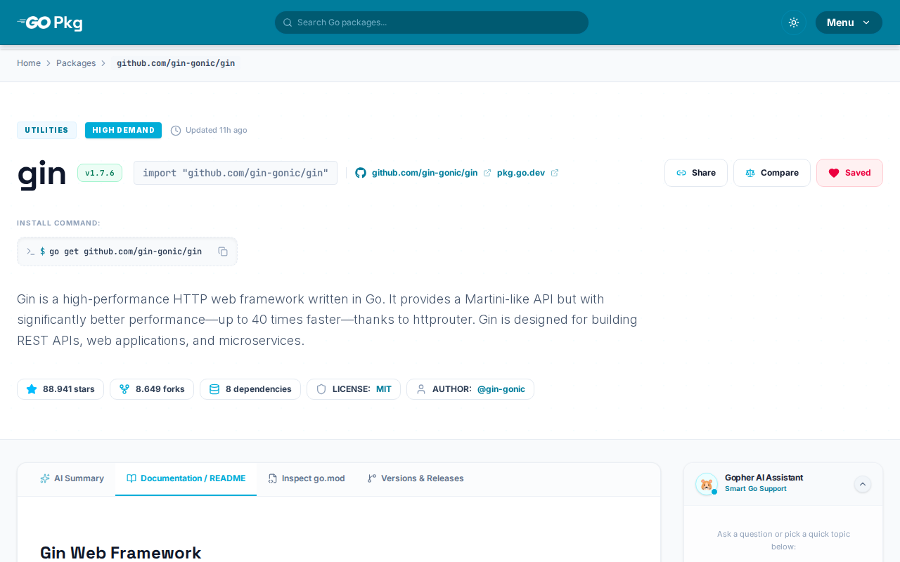
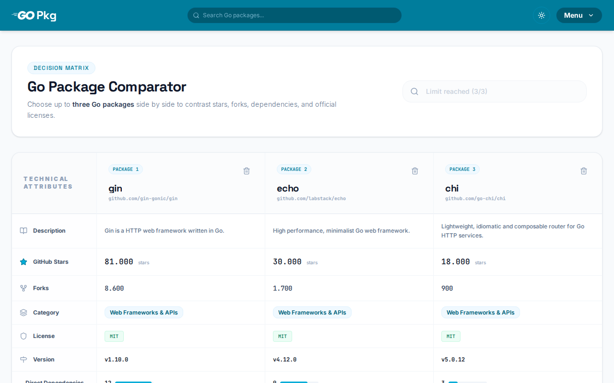
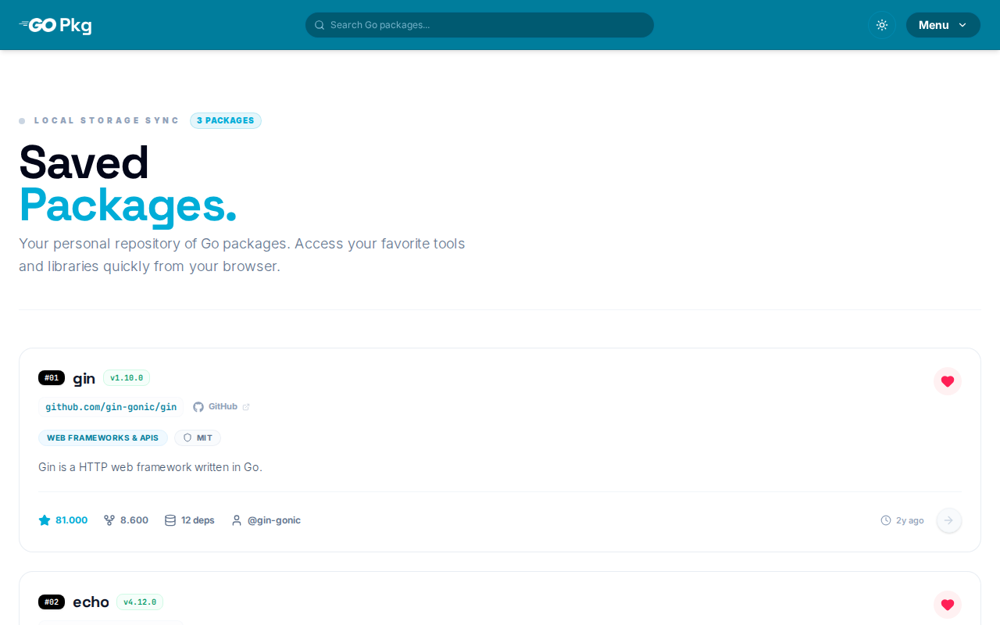

<br>
<div align="center">
  
  
  
  
  
</div>
<br>

<p align="center">
  <strong>Idioma:</strong> <a href="README.md">English</a> | <a href="README.pt-BR.md">Português (BR)</a> | Español
</p>

<h1 align="center">GoPkg</h1>

<p align="center">
  Una plataforma moderna de descubrimiento y exploración de paquetes Go. Busca en el ecosistema, inspecciona detalles de paquetes, compara bibliotecas lado a lado y obtén información con IA.
  <br>
  <a href="#sobre-el-proyecto"><strong>Explorar la documentación »</strong></a>
  <br>
  <br>
  <a href="https://github.com/dariomatias-dev/go-pkg/issues">Reportar Error</a> ·
  <a href="https://github.com/dariomatias-dev/go-pkg/issues">Solicitar Funcionalidad</a>
</p>

## Índice

- [Sobre el Proyecto](#sobre-el-proyecto)
- [Funcionalidades](#funcionalidades)
- [Tecnologías Utilizadas](#tecnolog%C3%ADas-utilizadas)
- [Capturas de Pantalla](#capturas-de-pantalla)
- [Cómo Empezar](#c%C3%B3mo-empezar)
- [Scripts](#scripts)
- [Licencia](#licencia)
- [Autor](#autor)

## Sobre el Proyecto

GoPkg es una plataforma web para descubrir y explorar paquetes Go, creada como una alternativa práctica a [pkg.go.dev](https://pkg.go.dev).

Agrega datos de la API de GitHub y del Go Module Proxy oficial para ofrecer metadatos completos de paquetes: estrellas, forks, licencia, README, contenido de `go.mod`, historial completo de versiones, releases de GitHub y calificaciones de Go Report Card: todo en una sola interfaz.

La plataforma también integra **Gopher AI**, un asistente de chat impulsado por Google Gemini 2.5 Flash capaz de explicar cualquier paquete, generar ejemplos de código Go idiomático y responder preguntas generales sobre Go con contexto.

## Funcionalidades

- **Búsqueda de Paquetes**: Búsqueda de texto completo con filtros por categoría, etiqueta y orden (estrellas, forks, última actualización).
- **Detalle del Paquete**: Metadatos completos: descripción, estrellas, forks, licencia, README, `go.mod`, lista de versiones y releases de GitHub.
- **Go Report Card**: Calificación de calidad de código (A+–F) obtenida de [goreportcard.com](https://goreportcard.com).
- **Paquetes Populares**: Repositorios Go en tendencia clasificados por estrellas en GitHub, enriquecidos con metadatos de Go Proxy.
- **Comparar**: Comparación lado a lado de múltiples paquetes según métricas clave.
- **Favoritos**: Guarda paquetes localmente para referencia rápida.
- **Gopher AI**: Asistente de chat contextual enfocado en un paquete específico o en Go en general.
- **Resumen con IA**: Resumen técnico generado automáticamente con propósito, funcionalidades clave, ejemplo de uso y casos de uso comunes.
- **Modo Oscuro / Claro**: Tema basado en el sistema con opción manual.

## Tecnologías Utilizadas

- **[Next.js](https://nextjs.org/)**: Framework de React con App Router, React Server Components y caché integrada.
- **[React](https://react.dev/)**: Biblioteca de UI para construir interfaces basadas en componentes.
- **[TypeScript](https://www.typescriptlang.org/)**: Superset tipado de JavaScript.
- **[Tailwind CSS](https://tailwindcss.com/)**: Framework CSS utility-first para desarrollo ágil de UI.
- **[shadcn/ui](https://ui.shadcn.com/)**: Biblioteca de componentes accesibles construida sobre Radix UI.
- **[Google Gemini](https://ai.google.dev/)**: Modelo de IA que impulsa Gopher AI y los resúmenes de paquetes.
- **[GitHub REST API](https://docs.github.com/en/rest)**: Metadatos de repositorios, releases y contenido de README.
- **[Go Module Proxy](https://proxy.golang.org/)**: Listas de versiones, archivos `go.mod` y conteo de dependencias.

## Capturas de Pantalla

<div align="center">
  
  
  
  
  
  
</div>

## Cómo Empezar

Sigue estos pasos para ejecutar el proyecto localmente.

### Requisitos Previos

- Node.js 20+
- pnpm

### Instalación

Clona el repositorio:

```bash
git clone https://github.com/dariomatias-dev/go-pkg.git
```

Entra en el directorio del proyecto:

```bash
cd go-pkg
```

Instala las dependencias:

```bash
pnpm install
```

### Variables de Entorno

Copia el archivo de ejemplo y completa los valores:

```bash
cp .env.example .env
```

| Variable         | Requerida | Descripción                                                                                                                                                                                                                                         |
| ---------------- | --------- | --------------------------------------------------------------------------------------------------------------------------------------------------------------------------------------------------------------------------------------------------- |
| `GEMINI_API_KEY` | Sí        | Clave de la API de Google Gemini para Gopher AI y los resúmenes de paquetes. Obtén una en [aistudio.google.com](https://aistudio.google.com).                                                                                                       |
| `GITHUB_TOKEN`   | No        | Token de acceso personal de GitHub. Eleva el límite de peticiones de la API de 60 a 5,000 por hora. Genera uno en [github.com/settings/tokens](https://github.com/settings/tokens): no se necesitan permisos especiales para repositorios públicos. |

### Ejecutando el Proyecto

Para iniciar el servidor de desarrollo:

```bash
pnpm dev
```

Abre [http://localhost:3000](http://localhost:3000) en tu navegador para ver el resultado.

## Scripts

| Script       | Comando           | Descripción                                                                                                                                                  |
| ------------ | ----------------- | ------------------------------------------------------------------------------------------------------------------------------------------------------------ |
| `dev`        | `pnpm dev`        | Inicia el servidor de desarrollo con hot reload.                                                                                                             |
| `build`      | `pnpm build`      | Crea una build de producción optimizada.                                                                                                                     |
| `start`      | `pnpm start`      | Ejecuta la build de producción. Requiere `pnpm build` antes.                                                                                                 |
| `lint`       | `pnpm lint`       | Ejecuta ESLint en todo el proyecto.                                                                                                                          |
| `screenshot` | `pnpm screenshot` | Abre un navegador headless contra el servidor de desarrollo en ejecución y captura una captura de cada página en `public/screenshots/`, usadas en el README. |

## Licencia

Distribuido bajo la **Licencia MIT**. Consulta el archivo [LICENSE](LICENSE) para más información.

## Autor

Desarrollado por **Dário Matias**:

- **Portafolio**: [dariomatias-dev.com](https://dariomatias-dev.com)
- **GitHub**: [dariomatias-dev](https://github.com/dariomatias-dev)
- **Email**: [dariomatias.dev@gmail.com](mailto:dariomatias.dev@gmail.com)
- **Instagram**: [@dariomatias_dev](https://instagram.com/dariomatias_dev)
- **LinkedIn**: [linkedin.com/in/dariomatias-dev](https://linkedin.com/in/dariomatias-dev)
