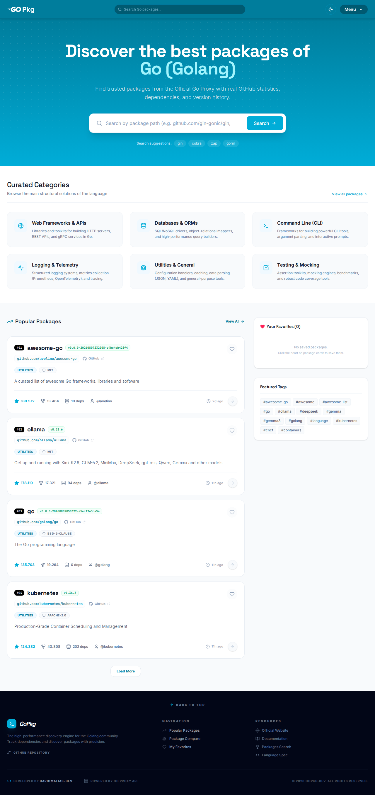
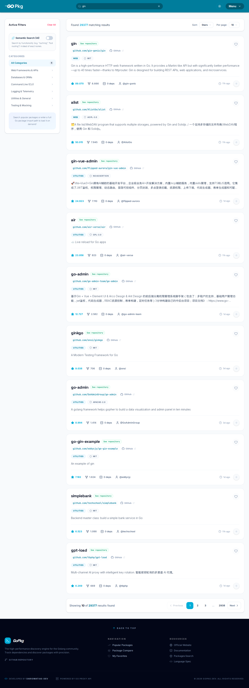
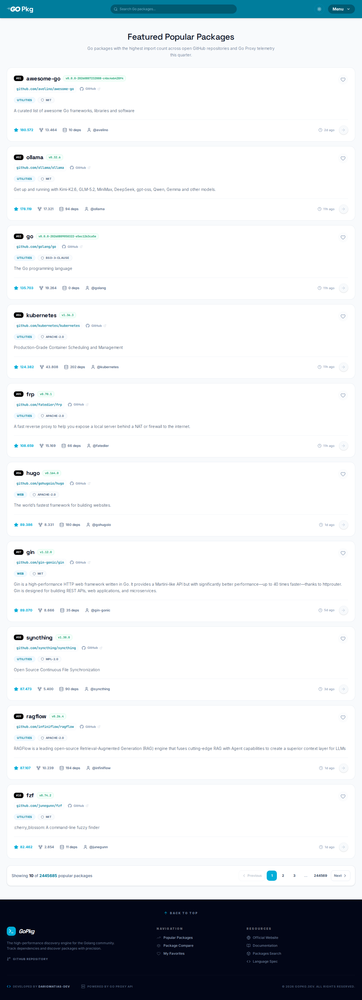
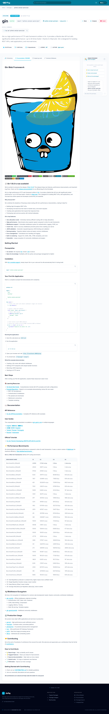
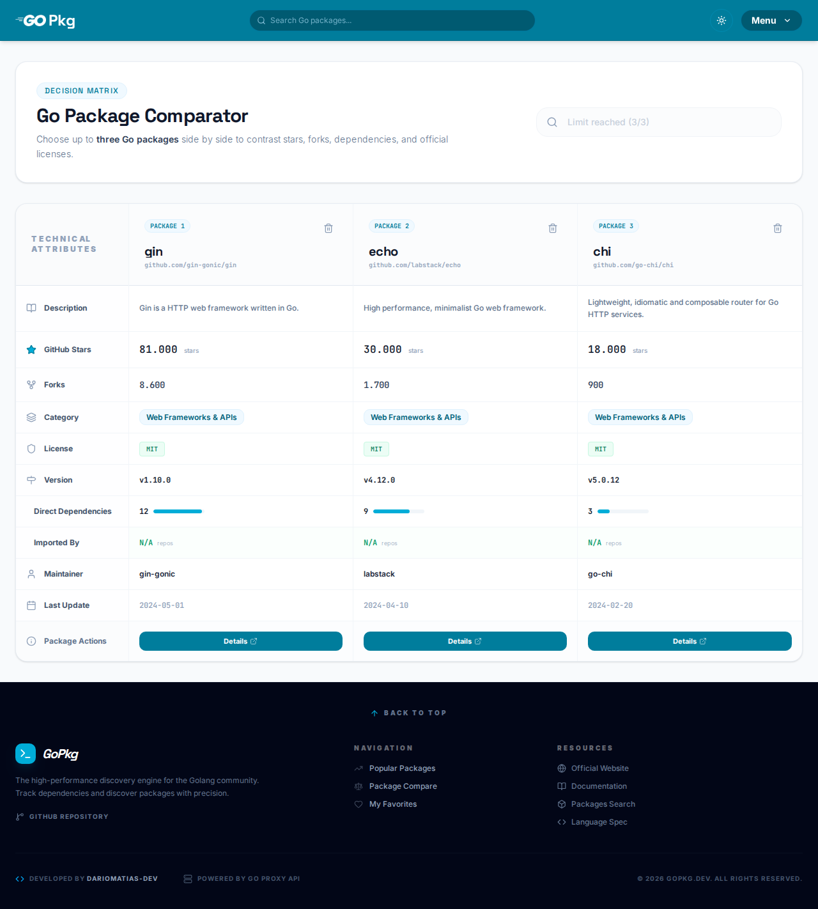
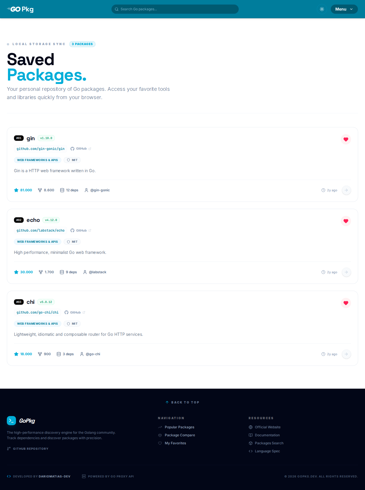

<br>
<div align="center">
  
  
  
  
  
</div>
<br>
<div align="center">
  <a href="https://github.com/dariomatias-dev/go-pkg/actions/workflows/ci.yaml">
    
  </a>
  
  <a href="LICENSE">
    
  </a>
</div>
<br>

<p align="center">
<a href="README.md">English</a> · <a href="README.es.md">Español</a> · <strong>Português (BR)</strong>
</p>

<h1 align="center">GoPkg</h1>

<p align="center">
  Uma plataforma moderna de descoberta e exploração de pacotes Go. Pesquise o ecossistema, inspecione detalhes de pacotes, compare bibliotecas lado a lado e obtenha insights com IA.
  <br>
  <a href="#sobre-o-projeto"><strong>Explorar a documentação »</strong></a>
  <br>
  <br>
  <a href="https://github.com/dariomatias-dev/go-pkg/issues">Reportar Bug</a> ·
  <a href="https://github.com/dariomatias-dev/go-pkg/issues">Solicitar Funcionalidade</a>
</p>

## Índice

- [Sobre o Projeto](#sobre-o-projeto)
- [Funcionalidades](#funcionalidades)
- [Tecnologias Utilizadas](#tecnologias-utilizadas)
- [Capturas de Tela](#capturas-de-tela)
- [Como Começar](#como-começar)
- [Scripts](#scripts)
- [Testes](#testes)
- [Documentação](#documentação)
- [Contribuindo](#contribuindo)
- [Licença](#licença)
- [Autor](#autor)

## Sobre o Projeto

GoPkg é uma plataforma web para descoberta e exploração de pacotes Go, construída como uma alternativa prática ao [pkg.go.dev](https://pkg.go.dev).

Ela agrega dados da API do GitHub e do Go Module Proxy oficial para fornecer metadados ricos sobre pacotes: estrelas, forks, licença, README, conteúdo do `go.mod`, histórico completo de versões, releases do GitHub e notas do Go Report Card: tudo em uma única interface.

A plataforma também integra o **Gopher AI**, um assistente de chat baseado no Google Gemini 2.5 Flash capaz de explicar qualquer pacote, gerar exemplos de código Go idiomático e responder dúvidas gerais sobre Go com contexto.

## Funcionalidades

- **Busca de Pacotes**: Busca por texto completo com filtros por categoria, tag e ordem (estrelas, forks, última atualização).
- **Detalhe do Pacote**: Metadados completos: descrição, estrelas, forks, licença, README, `go.mod`, lista de versões e releases do GitHub.
- **Go Report Card**: Nota de qualidade de código (A+–F) obtida do [goreportcard.com](https://goreportcard.com).
- **Pacotes Populares**: Repositórios Go em alta ranqueados por estrelas no GitHub, enriquecidos com metadados do Go Proxy.
- **Comparar**: Comparação lado a lado de múltiplos pacotes com métricas-chave.
- **Favoritos**: Salve pacotes localmente para referência rápida.
- **Gopher AI**: Assistente de chat contextual focado em um pacote específico ou em Go de forma geral.
- **Resumo com IA**: Resumo técnico gerado automaticamente com propósito, funcionalidades principais, exemplo de uso e casos comuns.
- **Modo Escuro / Claro**: Tema baseado no sistema com alternância manual.

## Tecnologias Utilizadas

- **[Next.js](https://nextjs.org/)**: Framework React com App Router, React Server Components e cache integrado.
- **[React](https://react.dev/)**: Biblioteca de UI para construção de interfaces baseadas em componentes.
- **[TypeScript](https://www.typescriptlang.org/)**: Superset tipado do JavaScript.
- **[Tailwind CSS](https://tailwindcss.com/)**: Framework CSS utilitário para desenvolvimento ágil de UI.
- **[shadcn/ui](https://ui.shadcn.com/)**: Biblioteca de componentes acessíveis construída sobre o Radix UI.
- **[Google Gemini](https://ai.google.dev/)**: Modelo de IA que alimenta o Gopher AI e os resumos de pacotes.
- **[GitHub REST API](https://docs.github.com/en/rest)**: Metadados de repositórios, releases e conteúdo do README.
- **[Go Module Proxy](https://proxy.golang.org/)**: Listas de versões, arquivos `go.mod` e contagem de dependências.

## Capturas de Tela

<div align="center">
  
  
  
  
  
  
</div>

## Como Começar

Siga os passos abaixo para executar o projeto localmente.

### Pré-requisitos

- Node.js 22+ (veja `.nvmrc`)
- pnpm 10 (veja `packageManager` no `package.json`)

### Instalação

Clone o repositório:

```bash
git clone https://github.com/dariomatias-dev/go-pkg.git
```

Acesse o diretório do projeto:

```bash
cd go-pkg
```

Instale as dependências:

```bash
pnpm install
```

### Variáveis de Ambiente

Copie o arquivo de exemplo e preencha os valores:

```bash
cp .env.example .env
```

| Variável               | Obrigatória | Descrição                                                                                                                                                                                                                                           |
| ---------------------- | ----------- | --------------------------------------------------------------------------------------------------------------------------------------------------------------------------------------------------------------------------------------------------- |
| `GEMINI_API_KEY`       | Sim         | Chave da API do Google Gemini para o Gopher AI e resumos de pacotes. Obtenha uma em [aistudio.google.com](https://aistudio.google.com).                                                                                                             |
| `GITHUB_TOKEN`         | Não         | Token de acesso pessoal do GitHub. Eleva o limite de requisições da API de 60 para 5.000 por hora. Gere um em [github.com/settings/tokens](https://github.com/settings/tokens): nenhuma permissão especial é necessária para repositórios públicos. |
| `NEXT_PUBLIC_SITE_URL` | Não         | URL canônica de produção, usada em `metadataBase`, `sitemap.xml` e nas URLs de imagem Open Graph/Twitter. Usa `http://localhost:3000` como padrão em dev.                                                                                           |

### Executando o Projeto

Para iniciar o servidor de desenvolvimento:

```bash
pnpm dev
```

Abra [http://localhost:3000](http://localhost:3000) no navegador para visualizar o resultado.

## Scripts

| Script          | Comando              | Descrição                                                                                                                                                 |
| --------------- | -------------------- | --------------------------------------------------------------------------------------------------------------------------------------------------------- |
| `dev`           | `pnpm dev`           | Inicia o servidor de desenvolvimento com hot reload.                                                                                                      |
| `build`         | `pnpm build`         | Cria uma build de produção otimizada.                                                                                                                     |
| `start`         | `pnpm start`         | Executa a build de produção. Requer `pnpm build` antes.                                                                                                   |
| `lint`          | `pnpm lint`          | Executa o ESLint em todo o projeto.                                                                                                                       |
| `format`        | `pnpm format`        | Formata o código com o Prettier.                                                                                                                          |
| `format:check`  | `pnpm format:check`  | Confere a formatação sem escrever alterações.                                                                                                             |
| `typecheck`     | `pnpm typecheck`     | Roda `tsc --noEmit`.                                                                                                                                      |
| `test`          | `pnpm test`          | Roda a suíte de testes unitários/componente (Vitest).                                                                                                     |
| `test:coverage` | `pnpm test:coverage` | Roda a suíte com cobertura; falha abaixo do limite configurado.                                                                                           |
| `e2e`           | `pnpm e2e`           | Roda a suíte de testes end-to-end (Playwright) contra uma build de produção.                                                                              |
| `verify`        | `pnpm verify`        | O gate local que espelha o CI: format, lint, typecheck, test:coverage, build, nessa ordem. Veja [docs/contributing.pt-BR.md](docs/contributing.pt-BR.md). |
| `analyze`       | `pnpm analyze`       | Builda com o bundle analyzer habilitado.                                                                                                                  |
| `screenshot`    | `pnpm screenshot`    | Abre um navegador headless contra o servidor de desenvolvimento em execução e captura um print de cada página em `public/screenshots/`, usados no README. |

## Testes

```bash
pnpm verify   # o mesmo gate que o CI roda: format, lint, typecheck, test:coverage, build
pnpm e2e      # smoke flows do Playwright (precisa de uma build de produção)
```

Veja [docs/contributing.pt-BR.md](docs/contributing.pt-BR.md) pro que cada job do CI confere e se ele bloqueia merge.

## Documentação

Além deste README, o diretório [`docs/`](docs/) cobre:

- [Arquitetura](docs/architecture.pt-BR.md) - árvore de diretórios, a regra de camadas, a fronteira Server/Client Component, estratégia de cache, e a limitação conhecida do rate limiter.
- [Dependências](docs/dependencies.pt-BR.md) - por que `next`, `eslint-config-next`, `react` e `react-dom` estão fixados em versões exatas.
- [Contribuindo](docs/contributing.pt-BR.md) - setup completo, o checklist pré-PR, o que o CI confere, e como reproduzi-lo localmente com `act`.
- [Política de Segurança](docs/security.pt-BR.md) - versões suportadas, escopo, e como reportar uma vulnerabilidade de forma privada.
- [Código de Conduta](docs/code_of_conduct.pt-BR.md) - Contributor Covenant 2.1.

Cada um também está disponível em [English](docs/architecture.md) e [Español](docs/architecture.es.md).

## Contribuindo

Contribuições tornam a comunidade de código aberto um lugar excelente para aprender e criar. Toda contribuição é bem-vinda.

Antes de abrir um pull request, consulte [docs/contributing.pt-BR.md](docs/contributing.pt-BR.md) para o setup local, o checklist pré-PR, a convenção de mensagens de commit (Conventional Commits) e as regras de branching deste projeto.

## Licença

Distribuído sob a **Licença MIT**. Consulte o arquivo [LICENSE](LICENSE) para mais informações.

## Autor

Desenvolvido por **Dário Matias**:

- **Portfólio**: [dariomatias-dev.com](https://dariomatias-dev.com)
- **GitHub**: [dariomatias-dev](https://github.com/dariomatias-dev)
- **E-mail**: [dariomatias.dev@gmail.com](mailto:dariomatias.dev@gmail.com)
- **Instagram**: [@dariomatias_dev](https://instagram.com/dariomatias_dev)
- **LinkedIn**: [linkedin.com/in/dariomatias-dev](https://linkedin.com/in/dariomatias-dev)
